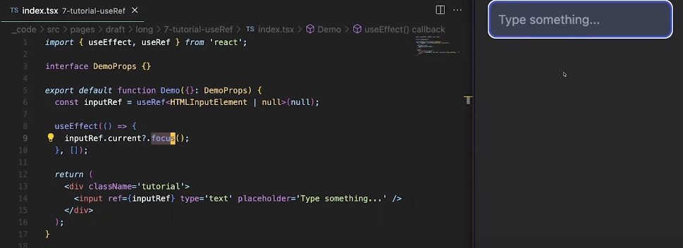
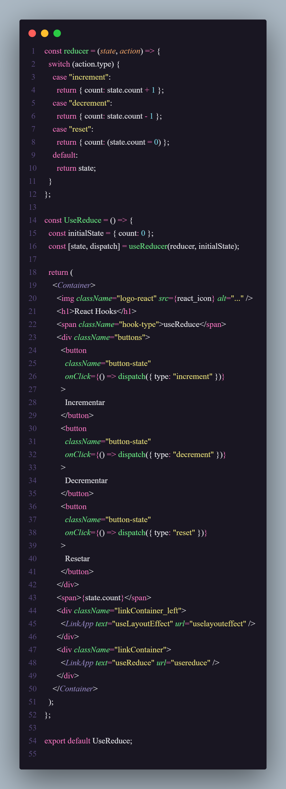
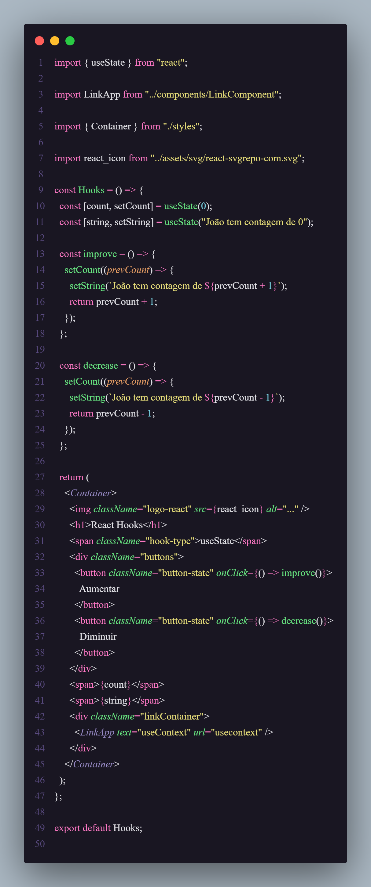
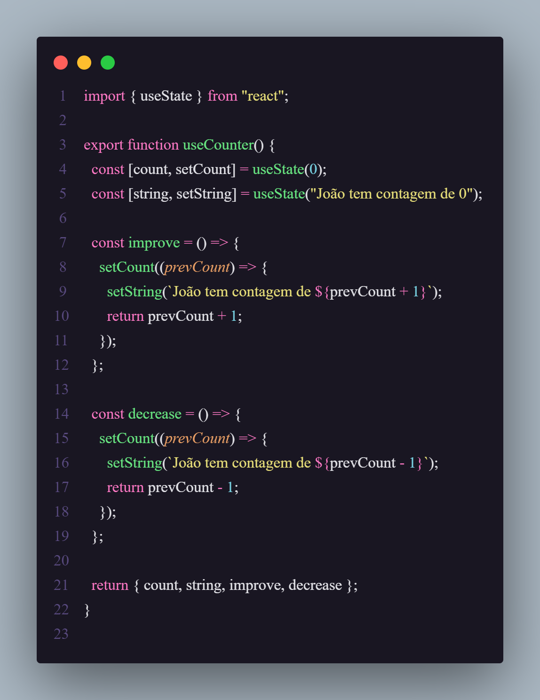
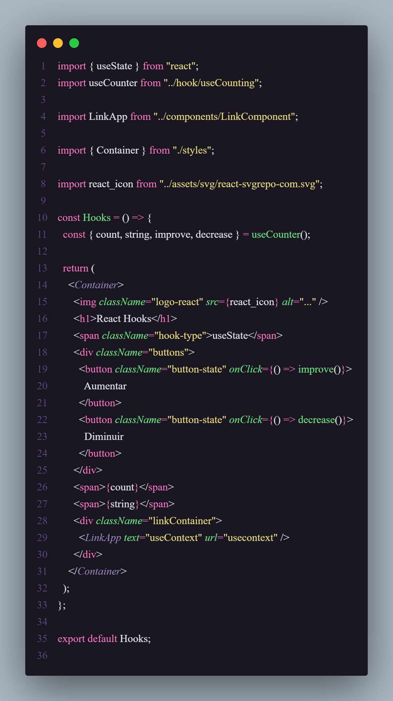

# React Hooks

<div align="left">
  
  
  
  
</div>

<br/>


<br/>

> Neste repositório, estou registrando minha experiência ao aprofundar meus estudos nos React Hooks, uma funcionalidade central do React que facilita o desenvolvimento de aplicações web modernas e ágeis, com um controle de estado mais simplificado.

### Hooks de Gerenciamento de estados

<ul>
  <li>useState ✓</li>
  <li>useReducer ✓</li>
  <li>useContext ✓</li>
  <li>useRef ✓</li>
  <li>useImperativeHandle</li>
  <li>useSyncExternalStore</li>
</ul>

### Hooks de Gerenciamento de Ciclo de Vida

<ul>
 <li>useEffect ✓</li>
   <li>useLayoutEffect ✓</li>
   <li>useCallback </li>
   <li>useMemo</li>
</ul>

# useState

<div>Gerencia estados atômicos do componente:</div>
<div>
Ele permite que você adicione e controle "estado" em componentes funcionais.
</div>
<div>
Imagine que você tem uma variável que quer mudar ao longo do tempo, como o número de cliques em um botão. O useState te ajuda a criar essa variável, e também a função que vai atualizar seu valor.</div>
<br/>

```js
const [contador, setContador] = useState(0);
```

<br />


```js
const improve = () => {
  setCount((prevCount) => prevCount + 1);
};

const decrease = () => {
  setCount((prevCount) => prevCount - 1);
};
```

<ul>
  <li>A função improve aumenta o valor do estado count em 1.</li>
  <li>A função decrease diminui o valor do estado count em 1.</li>
  <li>Ambas utilizam a função setCount com uma callback que recebe o valor anterior do estado (prevCount) e o atualiza.</li>
</ul>


<strong>Contornando o problema da assincronicidade entre os estados com funções internas</strong>


```js
const [count, setCount] = useState(0);
const [string, setString] = useState("João tem contagem de 0");
```

<ul>
  <li><strong>count</strong>: controla a contagem numérica.</li>
  <li><strong>string</strong>: controla a mensagem que reflete o valor atual de <code>count</code>.</li>
  <li>Ambos são inicializados: <strong>count</strong> com 0 e <strong>string</strong> com a frase correspondente ao valor inicial do contador.</li>
</ul>

```js
const improve = () => {
  setCount((prevCount) => {
    setString(`João tem contagem de ${prevCount + 1}`);
    return prevCount + 1;
  });
};
```

<ul>
  <li>Quando chamada, a função aumenta o valor do estado <strong>count</strong> em 1.</li>
  <li>Ela utiliza o valor anterior (<code>prevCount</code>), calcula o novo valor (<code>prevCount + 1</code>), e atualiza o estado <strong>string</strong> para refletir essa mudança.</li>
  <li>A função <code>setString</code> atualiza a mensagem para algo como "João tem contagem de 1", "João tem contagem de 2", etc.</li>
  <li>No final, <code>setCount</code> retorna o novo valor incrementado.</li>
  <li>O mesmo acontece com a função de decrementrar.</li>
</ul>

<p>
 SetCount e setString são assíncronas. Isso significa que quando você chama setCount, o novo estado não é imediatamente refletido na próxima linha do código, pois o React pode agrupar várias atualizações de estado para melhorar a performance.
</p>


# useContext

<div>
Ele permite compartilhar dados entre vários componentes sem precisar passar as informações manualmente por cada nível (props drilling).
</div>
<div>
Pense no useContext como um "atalho" para acessar informações globais que são usadas por vários componentes. Isso é útil, por exemplo, quando você tem dados como o tema do site (claro/escuro) ou a autenticação do usuário.</div>

<br/>

```js
const tema = useContext(ThemeContext);
```

<strong>Props drilling</strong>

<p>
Props drilling é o termo usado em React quando você precisa passar props (dados) de um componente "pai" para um componente "filho", e depois para outro "filho" e assim por diante, através de várias camadas, até que o componente que realmente precisa desses dados os receba.

</p>


<p>
A função <strong>changeName</strong> está sendo passada de UseContext para ChildrenOne e, em seguida, para ChildrenTwo. Isso é props drilling, porque ChildrenOne não precisa usar a função, mas a transporta até ChildrenTwo.</p>


<strong>
  Como utilizar o useContext em 3 passos:
</strong>
<ul>
  <li><strong>Criar um contexto com <code>createContext()</code></strong></li>
  <li><strong>Fornecer o contexto com <code>Context.Provider</code></strong></li>
  <li><strong>Consumir o contexto com <code>useContext()</code></strong></li>
</ul>

```js
import React, { createContext, useState } from "react";

const NameContext = createContext();

export const NameProvider = ({ children }) => {
  const [name, setName] = useState("João Marcos");

  return (
    <NameContext.Provider value={{ name, setName }}>
      {children}
    </NameContext.Provider>
  );
};
```

<p>
Em volta dos componentes que precisam acessar o contexto, utilizar o Provider. Neste caso, o NameProvider é usado para envolver os componentes que precisam do valor name e da função setName.</p>

```js
import { NameProvider } from "./NameContext";
import ChildrenOne from "./ChildrenOne";

const App = () => {
  return (
    <NameProvider>
      <ChildrenOne />
    </NameProvider>
  );
};

export default App;
```

<p>
Consumindo o contexto com useContext</p>

```js
import React, { useContext } from "react";
import { NameContext } from "./NameContext";

const ChildrenOne = () => {
  const { name, setName } = useContext(NameContext);

  return (
    <div>
      <h1>{name}</h1>
    </div>
  );
};

export default ChildrenOne;
```

### Criando um elemento capaz de alterar os values do contexto


<br/>

<ul>
    <li><strong>AppContext</strong>: É o contexto que você criou para compartilhar dados (neste caso, o estado do usuário) entre os componentes.</li>
    <li><strong>UserProvider</strong>: É o componente que vai fornecer (<code>user</code> e <code>setUser</code>) para todos os componentes dentro dele.</li>
    <li><strong>useState</strong>: Mantém o estado do <code>user</code> e a função <code>setUser</code> permite atualizar esse estado.</li>
    <li>Qualquer componente dentro do <strong>UserProvider</strong> pode acessar e modificar o estado do <code>user</code> usando o <code>useContext(AppContext)</code>.</li>
</ul>

### Provendo o contexto para toda a aplicação


### Consumindo o contexto no elemento filho


### Spread Operator

```js
setUser({ ...user, name: "Maria Silva" });
```

<ul>
    <li><strong>setUser</strong>: Esta é a função que foi obtida a partir do <code>useState</code>, ou do contexto, e é usada para atualizar o estado do <code>user</code>.</li>
    <li><strong>{ ...user }</strong>: Isso é chamado de <em>spread operator</em>. Ele copia todas as propriedades existentes do objeto <code>user</code> para um novo objeto.</li>
    <li>Por exemplo, se o <code>user</code> tem <code>{ name: "João Marcos", age: 21 }</code>, o operador de spread cria uma cópia dessas propriedades.</li>
    <li><strong>name: "João da Massa"</strong>: Aqui, você está sobrescrevendo a propriedade <code>name</code> do objeto copiado, mudando seu valor para "João da Massa".</li>
    <li>O resultado final é um novo objeto com todas as propriedades anteriores do <code>user</code>, exceto que o <code>name</code> foi atualizado para "João da Massa".</li>
</ul>


### Usando um Custom Hook


<strong>Criação do Contexto:</strong>

```js
export const AppContext = createContext(undefined);
```

Cria um contexto (AppContext) com valor inicial undefined.
<strong>
Hook Personalizado useUserContext:
</strong>

```js
export function useUserContext() {
  const { user, setUser } = useContext(AppContext);
}
```

Acessa os valores user e setUser do contexto.

<strong>Verificação de Contexto:</strong>

```js
if (user == undefined || setUser == undefined) {
  throw new Error("Component out of context");
}
```

Lança um erro se user ou setUser não estiverem disponíveis, garantindo que o componente esteja dentro do Provider.

<strong>Retorno</strong>

```js
return { user, setUser };
```

### Gerando o provider com o Custom Hook


<br/>

# useRef

### Diferença entre o useState

<ul>
  <li>Use <code>useState</code> quando você precisar que uma mudança de valor desencadeie uma re-renderização.</li>
  <li>Use <code>useRef</code> quando quiser armazenar um valor persistente entre renderizações sem que mudanças nele causem re-renderizações.</li>
</ul>

### Para oq usar ?

Acessar e manipular diretamente elementos do DOM: Se você precisar manipular elementos HTML diretamente, como focar em um input, useRef é perfeito.

<p>Ref é muito usado em Formulários</p>

```js
const inputRef = useRef(null);

// Alterar o valor não causa re-renderização
inputRef.current = "novo valor";
```

### Acessando o valor

Basta apenas utilizar o `.current`

### Manipulando a DOM

Como já foi dito o principal uso do useRef é manipulando DOM

```js
const buttonRef = useRef(0);

useEffect(() => {
  buttonRef.current.click();
}, []);
```

### Exemplo de manipulação com um input



Dessa maneira sempre que aplicação for carregada(ou re-renderizada), ocorrerá o `focus` no input

# useReducer

<p>
   useReducer é um hook do React utilizado para gerenciamento de estado, especialmente em cenários onde o estado é complexo ou envolve múltiplas transições baseadas em diferentes ações. Ele é inspirado no padrão de reducers do Redux e funciona de forma semelhante a uma máquina de estados.
</p>

<p>Enquanto o useState é ideal para gerenciar estados simples, o useReducer oferece mais controle e estrutura para manipular estados que envolvem várias ações e lógicas.</p>



<ul>
  <li><strong>Estado inicial:</strong> O estado inicial <code>{ count: 0 }</code> é passado para o <code>useReducer</code>.</li>
  <li><strong>Função reducer:</strong>
    <ul>
      <li>A função <code>reducer</code> verifica o tipo da ação (<code>increment</code>, <code>decrement</code> ou <code>reset</code>) e, com base nisso, retorna um novo estado.</li>
      <li>O estado é imutável, então a função sempre cria um novo estado em vez de modificar o estado existente.</li>
    </ul>
  </li>
  <li><strong>Dispatch:</strong>
    <ul>
      <li>O <code>dispatch</code> dispara ações para o <code>reducer</code>, que calcula o novo estado.</li>
      <li>Exemplo: Quando o botão "Incrementar" é clicado, ele dispara a ação <code>{ type: 'increment' }</code>, e o estado é atualizado.</li>
    </ul>
  </li>
</ul>

```js
const reducer = (state, action) => {
  switch (action.type) {
    case "increment":
      return { count: state.count + 1, name: "João da Massa" };
    case "decrement":
      return { count: state.count - 1, name: "João da Banana" };
    case "reset":
      return { count: (state.count = 0), name: "João" };
    default:
      return state;
  }
};
```

```js
const initialState = { count: 0, name: "João" };
const [state, dispatch] = useReducer(reducer, initialState);
```

```js
<button
          className="button-state"
          onClick={() => dispatch({ type: "increment" })}
        >
          Incrementar
        </button>
        <button
          className="button-state"
          onClick={() => dispatch({ type: "decrement" })}
        >
          Decrementar
        </button>
        <button
          className="button-state"
          onClick={() => dispatch({ type: "reset" })}
        >
          Resetar
        </button>
```

# useEffect

<p>Permite a criação de reações nas etapas do ciclo de vida do componente</p>


### Criando um useEffect para um estado


### Criando um useEffect para inicialização

Para que o useEffect seja executado apenas na inicialização do componente , precisa passar um array de dependências vazio ([]) como segundo argumento. I

```js
useEffect(() => {
  console.log("Estado de inicialização");
  changeState();
}, []);
```


### Criando um useEffect para destruição do componente

Para executar uma função na destruição de um componente usando o useEffect,use um return dentro do useEffect.

```js
useEffect(() => {
  // Código executado quando o componente é montado

  return () => {
    // Código executado quando o componente é desmontado (cleanup)
  };
}, []); // O array de dependências vazio garante que o efeito só execute na montagem e na desmontagem
```

# useLayoutEffect

O `useLayoutEffect` é um hook do React que funciona de maneira semelhante ao useEffect, mas com uma diferença crucial: ele é executado sincronamente após as mudanças no DOM, antes que o navegador faça a pintura na tela. Isso significa que o código dentro de useLayoutEffect é executado logo após o React ter atualizado o DOM, mas antes que o usuário veja essas mudanças visuais.

### Quando usar

O useLayoutEffect é útil em situações onde você precisa realizar algum efeito que depende do layout final da página, como medir a posição ou o tamanho de um elemento no DOM e imediatamente tomar alguma ação baseada nessas medidas.

```js
import React, { useLayoutEffect, useRef, useState } from "react";

function ComponenteExemplo() {
  const divRef = useRef(null);
  const [altura, setAltura] = useState(0);

  useLayoutEffect(() => {
    // Medimos a altura da div e atualizamos o estado
    const alturaDiv = divRef.current.getBoundingClientRect().height;
    setAltura(alturaDiv);
  }, []); // Dependência vazia para rodar apenas uma vez após o layout ser calculado

  return (
    <div>
      <div ref={divRef} style={{ height: "200px", background: "lightblue" }}>
        Esta div tem 200px de altura.
      </div>
      <p>A altura da div é: {altura}px</p>
    </div>
  );
}
export default ComponenteExemplo;
```

### Exemplo sem useLayoutEffect

```js
import { useEffect, useRef, useState, useLayoutEffect } from "react";

import LinkApp from "../components/LinkComponent";

import { Container } from "./styles";

const userIDs = [1, 2];

import react_icon from "../assets/svg/react-svgrepo-com.svg";

const UseLayoutEffect = () => {
  const [userID, setUserID] = useState(userIDs[0]);
  const [isAdmin, setIsAdmin] = useState(true);

  let now = performance.now();
  while (performance.now() - now < 200) {
    // nothing yet
  }

  useEffect(() => {
    setIsAdmin(userID === userIDs[0]);
  }, [userID]);

  const handleChange = () => {
    const otherID = userIDs.find((id) => id !== userID);
    setUserID(otherID);
  };

  return (
    <Container>
      
      <h1>React Hooks</h1>
      <span className="hook-type">useLayoutEffect</span>
      <div className="buttons">
        <button className="button-state" onClick={handleChange}>
          Mudar
        </button>
      </div>
      <span>userID: {userID}</span>
      <span>Admin: {isAdmin ? "true" : "false"}</span>
      <span></span>
      <div className="linkContainer_left">
        <LinkApp text="useRef" url="useref" />
      </div>
      <div className="linkContainer">
        <LinkApp text="useLayoutEffect" url="uselayouteffect" />
      </div>
    </Container>
  );
};

export default UseLayoutEffect;
```

O problema do código atual é que a alteração no estado isAdmin ocorre no useEffect, que é assíncrono e roda após a renderização. Se você precisar que essa mudança no estado ocorra antes que o navegador faça o "paint" (pintura) da tela, você pode usar o useLayoutEffect. Isso garantirá que a mudança de isAdmin seja sincronizada com a renderização e o layout e sem bugs visuais.

### Agora com o useLayoutEffect

```js
import { useLayoutEffect, useRef, useState } from "react";

import LinkApp from "../components/LinkComponent";

import { Container } from "./styles";

const userIDs = [1, 2];

import react_icon from "../assets/svg/react-svgrepo-com.svg";

const UseLayoutEffect = () => {
  const [userID, setUserID] = useState(userIDs[0]);
  const [isAdmin, setIsAdmin] = useState(true);

  // Simula uma operação lenta
  let now = performance.now();
  while (performance.now() - now < 200) {
    // Bloqueio proposital por 200ms
  }

  // Substituindo useEffect por useLayoutEffect para garantir
  // que a mudança de isAdmin ocorra antes da renderização.
  useLayoutEffect(() => {
    setIsAdmin(userID === userIDs[0]);
  }, [userID]);

  const handleChange = () => {
    const otherID = userIDs.find((id) => id !== userID);
    setUserID(otherID);
  };

  return (
    <Container>
      
      <h1>React Hooks</h1>
      <span className="hook-type">useLayoutEffect</span>
      <div className="buttons">
        <button className="button-state" onClick={handleChange}>
          Mudar
        </button>
      </div>
      <span>userID: {userID}</span>
      <span>Admin: {isAdmin ? "true" : "false"}</span>
      <div className="linkContainer_left">
        <LinkApp text="useRef" url="useref" />
      </div>
      <div className="linkContainer">
        <LinkApp text="useLayoutEffect" url="uselayouteffect" />
      </div>
    </Container>
  );
};

export default UseLayoutEffect;
```

Como o código que altera isAdmin agora está no useLayoutEffect, ele é aplicado imediatamente antes da interface ser exibida, o que pode evitar mudanças inesperadas no layout durante a renderização

### Criando um Hook Personalizado

### Componente sem o Hook personalizado



### Criando um hook Personalizado



### Utilizando o hook Personalizado



# React + Vite

Este template fornece uma configuração mínima para fazer o React funcionar no Vite com HMR e algumas regras do ESLint.

Atualmente, dois plugins oficiais estão disponíveis:

- [@vitejs/plugin-react](https://github.com/vitejs/vite-plugin-react/blob/main/packages/plugin-react/README.md) uses [Babel](https://babeljs.io/) for Fast Refresh
- [@vitejs/plugin-react-swc](https://github.com/vitejs/vite-plugin-react-swc) uses [SWC](https://swc.rs/) for Fast Refresh
